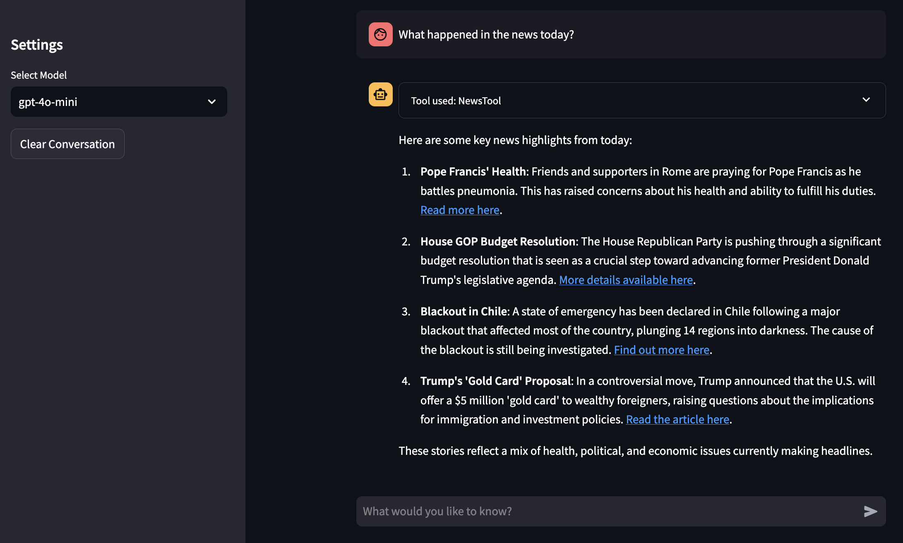

# Agent Framework

A flexible, extensible framework for building LLM-powered AI agents with tool integration capabilities.



## Overview

This agent framework allows you to:

- Connect to multiple LLM providers (OpenAI, Anthropic) through a unified API
- Create and register custom tools for your agent to use
- Intelligently route queries between direct LLM responses and tool execution
- Maintain conversation context across multiple interactions
- Deploy a user-friendly chat interface with Streamlit

The framework intelligently determines whether to process a query through direct LLM conversation or to use specialized tools, combining the benefits of both approaches.

## Key Features

- **Provider Abstraction**: Uses LiteLLM to support multiple LLM providers
- **Dynamic Tool Registry**: Easily create and register new agent tools
- **Smart Query Routing**: Automatically determines if tools are needed for a query
- **Conversation Memory**: Maintains context across multiple interactions
- **Streamlit UI**: User-friendly chat interface
- **Modular Architecture**: Easily extensible with new capabilities

## Installation

1. Clone the repository:

2. Install the required dependencies:
```bash
pip install -r requirements.txt
```

3. Create a `.env` file in the project root with your API keys:
```
OPENAI_API_KEY=your_openai_api_key
ANTHROPIC_API_KEY=your_anthropic_api_key
NEWS_API_KEY=your_news_api_key  # for the news tool (optional), key from https://newsapi.org/docs/get-started
```

4. For Gmail email functionality, set up OAuth2 credentials:
   - Go to [Google Cloud Console](https://console.cloud.google.com/)
   - Create a new project or select an existing one
   - Enable the Gmail API for your project
   - Go to "Credentials" and create an OAuth 2.0 Client ID
   - Download the credentials JSON file and rename it to `credentials.json`
   - Place `credentials.json` in the project root directory

## Project Structure

```
agent-framework/
├── src/
│   ├── core/
│   │   ├── __init__.py
│   │   ├── agent.py          # Main agent class
│   │   ├── llm_provider.py   # LiteLLM integration
│   │   ├── parser.py         # Response parsing logic
│   │   ├── memory.py         # Conversation memory
│   │   ├── router.py         # Query routing logic
│   │   └── agent_manager.py  # Agent persistence
│   ├── tools/
│   │   ├── __init__.py
│   │   ├── registry.py       # Tool registration & discovery
│   │   ├── base.py           # Base tool class 
│   │   └── implementations/  # Individual tools
│   │       ├── __init__.py
│   │       ├── timestamp.py
│   │       ├── news.py
│   │       └── email.py
│   └── tests/
│       ├── __init__.py
│       ├── test_openai_connection.py
│       ├── test_anthropic_connection.py
│       ├── test_conversation_memory.py
│       ├── test_news_tool.py
│       ├── test_timestamp_tool.py
│       └── test_email_tool.py
├── app.py                    # Streamlit app
├── tool_test.py              # Tool testing interface
├── .env                      # Environment variables
├── requirements.txt
└── README.md                 # You are here!
```

## Available Tools

The framework comes with four pre-built tools:

1. **TimestampTool**: Provides the current date and time in various formats
2. **NewsTool**: Fetches real news headlines using the NewsAPI (requires API key)
3. **GmailTool**: Send emails using Gmail API (requires OAuth2 setup)
4. **QRCodeTool**: Generate QR codes for URLs, text, contact information, or WiFi credentials

## How Tools Work

The framework uses an intelligent two-stage decision process to determine when and how to use tools:

### 1. Tool Registration and Discovery

Tools are registered using a decorator pattern through the `ToolRegistry`:

```python
@ToolRegistry.register()
class TimestampTool(BaseTool):
    description = "Get the current date and time"
    parameters = {
        "format": {
            "type": "string", 
            "description": "Optional: The format for the timestamp (default, iso, unix)",
            "required": False,
        }
    }
```

The `ToolRegistry` maintains a dictionary of all registered tools and provides methods to list tools, get specifications, and retrieve tool classes by name.

### 2. Tool Presentation to the LLM

Tools are dynamically presented to the LLM through the system message in the `Agent._build_system_message()` method. The system message includes:

- **Tool descriptions**: What each tool does
- **Parameter specifications**: What parameters each tool accepts  
- **Usage instructions**: When and how to use tools
- **JSON format requirements**: How to structure tool calls

### 3. Query Routing and Tool Decision

The framework uses a **two-stage decision process**:

#### Stage 1: Query Routing (`QueryRouter`)
The `QueryRouter` class determines whether a query should use tools by:

1. Creating a prompt asking the LLM to decide if tools are needed
2. Providing examples of when tools should/shouldn't be used
3. Asking for a JSON decision with:
   - `use_tool`: Boolean indicating if tools should be used
   - `tool_name`: Specific tool to use (if any)
   - `reasoning`: Explanation for the decision

#### Stage 2: Tool Selection and Execution
If the router determines tools should be used, the agent:

1. **Enhances the system message** with specific tool directives
2. **Gets LLM response** with lower temperature (0.2) for more consistent tool usage
3. **Parses the response** using `OutputParser` to extract JSON tool calls
4. **Executes the tool** and gets results
5. **Generates final response** by having the LLM interpret the tool results

### 4. Tool Execution Flow

```python
async def _process_with_tools(self, user_input, suggested_tool=None):
    # 1. Get LLM to decide on tool usage
    tool_response = await self.llm.generate(
        system_message=enhanced_system_message,
        prompt=user_input,
        temperature=0.2,
    )
    
    # 2. Parse the response
    action = await self.parser.parse_json(tool_response)
    
    # 3. Execute the tool
    if "tool" in action and "parameters" in action:
        tool_name = action["tool"]
        params = action["parameters"]
        
        tool_class = ToolRegistry.get_tool(tool_name)
        tool = tool_class()
        tool_result = await tool.execute(**params)
        
        # 4. Store tool result in memory
        self.memory.add_tool_result(tool_name, tool_result)
        
        # 5. Generate final response using tool results
        followup_prompt = f"""The user asked: "{user_input}"
I've retrieved the following information:
{tool_result}

Please provide a helpful response to the user's query using this information."""
        
        final_response = await self.llm.generate(
            prompt=followup_prompt, 
            conversation_history=conversation_history
        )
```

### 5. Memory and Context

The framework maintains conversation memory and tool results separately:

```python
class ConversationMemory:
    def __init__(self, max_turns=10):
        self.messages = []  # Regular conversation
        self.tool_results = []  # Tool execution results
    
    def add_tool_result(self, tool_name, result):
        self.tool_results.append({
            "tool": tool_name,
            "result": result,
            "timestamp": datetime.datetime.now().isoformat(),
        })
```

Recent tool results are included in conversation context to provide continuity across interactions.

### 6. Key Design Principles

1. **Separation of Concerns**: Routing, execution, and response generation are separate
2. **Flexible Tool Interface**: Tools inherit from `BaseTool` and define their own parameters
3. **Robust Parsing**: The `OutputParser` handles various JSON formats and provides fallbacks
4. **Memory Management**: Tool results are stored separately from conversation history
5. **Error Handling**: Graceful fallbacks when tool execution fails

This architecture allows the framework to intelligently decide when to use tools versus providing conversational responses, while maintaining a clean separation between tool logic and conversation flow.

## Usage

### Running the Chat Interface

```bash
streamlit run app.py
```

This launches a Streamlit web interface where you can interact with your agent.

### Testing Tools Directly

```bash
streamlit run tool_test.py
```

This launches a simplified interface specifically for testing tool execution.

### Running Tests

All tests can be run from the project root directory:

```bash
# Test Gmail email tool (comprehensive test suite)
python3 -m src.tests.test_email_tool

# Test timestamp tool
python3 -m src.tests.test_timestamp_tool

# Test news tool
python3 -m src.tests.test_news_tool

# Test QR code tool
python3 -m src.tests.test_qr_code_tool

# Test conversation memory
python3 -m src.tests.test_conversation_memory

# Test LLM connections
python3 -m src.tests.test_openai_connection
python3 -m src.tests.test_anthropic_connection
```

**Note**: The email tool test includes comprehensive coverage but the agent integration test (which sends real emails) is commented out by default. To test actual email sending, edit `src/tests/test_email_tool.py` and uncomment the agent integration test.

### QR Code Tool Features

The QR Code Tool supports multiple types of QR codes:

- **Text QR Codes**: Encode plain text content
- **URL QR Codes**: Encode web addresses (automatically adds https:// if needed)
- **Contact QR Codes**: Encode contact information in vCard format (requires name and phone)
- **WiFi QR Codes**: Encode WiFi network credentials (requires SSID and password)

The tool provides three output formats:
- **description**: Detailed information about the generated QR code
- **text**: Simple confirmation with content
- **base64**: Base64 encoded image data for web applications

Example usage in the chat interface:
- "Generate a QR code for https://google.com"
- "Create a contact QR code for John Doe with phone +1234567890"
- "Make a WiFi QR code for network 'MyWiFi' with password 'password123'"

### Adding a New Tool

To add a new tool to your agent framework:

1. Create a new Python file in `src/tools/implementations/`
2. Define your tool class inheriting from `BaseTool`
3. Register it using the `@ToolRegistry.register()` decorator

Example:

```python
# src/tools/implementations/calculator.py
from ..base import BaseTool
from ..registry import ToolRegistry
import math

@ToolRegistry.register()
class CalculatorTool(BaseTool):
    description = "Perform mathematical calculations"
    parameters = {
        "expression": {
            "type": "string",
            "description": "The mathematical expression to evaluate"
        }
    }
    
    async def execute(self, expression):
        # A simple calculator with safety measures
        allowed_names = {
            'sin': math.sin, 'cos': math.cos, 'tan': math.tan,
            'sqrt': math.sqrt, 'pi': math.pi, 'e': math.e
        }
        
        try:
            # Safe evaluation of math expressions
            result = eval(expression, {"__builtins__": {}}, allowed_names)
            return f"The result of {expression} is {result}"
        except Exception as e:
            return f"Error calculating {expression}: {str(e)}"
```

## API Reference

### Agent Class

The main class that processes user queries and manages tool execution.

```python
agent = Agent(model="gpt-4o-mini", custom_system_message=None, memory_turns=10)
response = await agent.run("What time is it?")
```

### ToolRegistry

Handles registration and discovery of available tools.

```python
@ToolRegistry.register()
class MyCustomTool(BaseTool):
    # Tool implementation
    pass

# Get all registered tools
tools = ToolRegistry.list_tools()
```

### BaseTool

Base class for all tools, providing the standard interface.

```python
class MyTool(BaseTool):
    description = "Tool description"
    parameters = {
        "param1": {
            "type": "string",
            "description": "Parameter description",
            "required": True
        }
    }
    
    async def execute(self, param1):
        # Implementation
        return result
```

## Environment Variables

| Variable | Description | Required |
|----------|-------------|----------|
| OPENAI_API_KEY | OpenAI API key | Yes (for OpenAI models) |
| ANTHROPIC_API_KEY | Anthropic API key | Yes (for Claude models) |
| NEWS_API_KEY | NewsAPI key | Optional (for news tool) |

## Dependencies

- litellm: Unified interface for multiple LLM providers
- streamlit: Web interface
- python-dotenv: Environment variable management
- aiohttp: Async HTTP requests
- certifi: SSL certificate verification
